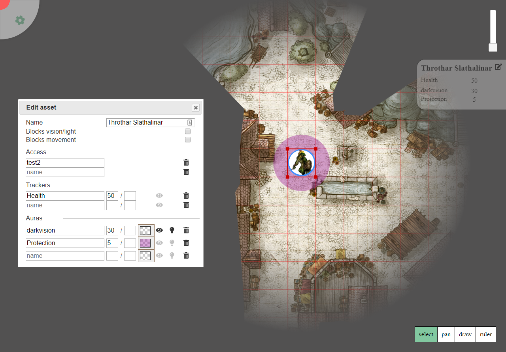

# PlanarAlly

A companion tool for when you travel into the planes.

PlanarAlly is a web tool that adds virtual battlemaps with various extras to your D&D toolbox.

_This project is still in early development; multiple bugs or structure changes can and will happen_

_Credits to Gogots for the background map used [source](https://gogots.deviantart.com/art/City-of-Moarkaliff-702295905)_

_Install instructions are [down below](#Installing-/-Backend-Requirements)_

## What you get

### Layers

Layers are a core aspect of any vtt.  PA currently provides a hardcoded set of layers.  I'd like to change this to be much more flexible in the future.

Currently these are:
* Map layer
* Grid layer
* Player/Tokens layer
* DM layer
* Fog of War layer
* Temporary layer

The map/token/dm/fow layer are selectable to do things in as a DM, players can only do things on the tokens layer.

The map layer is rendered under the grid so is ideal for things like the map/terrain.

The grid layer provides a grid throughout the entire screen. This can be fully turned off and tuned to your needs.

The FOW layer is a vision control layer.  You can interact with it using a tool but also as a layer, see the FOW chapter for more info!

The temporary layer is atm only used to draw rulers.  _It's likely that this will change_

Currently only the DM will have a layer selection UI in the bottom left.  When you select a layer, all tokens in higher layers
will be given a low opacity to give better visual feedback.
The shapes on the FOW layer are only rendered if you are on that layer to prevent clutter.

To change assets to a different layer, you can use the contextmenu provided on right click.  This also provides a way to
move overlapping assets behind eachother.

### Locations

The DM will have a special tool in the topleft of the screen where it can select a panel with all the registered locations.
By default only the start location is available, but the giant plus button allows for the creation of more locations.

At the moment this feature is very barebones, no removal of locations is possible yet and moving locations as a DM will
immediately also move all players currently.

Settings for this location can be adjusted in the normal settings menu.

### Grid

By default the grid is shown between the map layer and the token layer, so that tokens appear on top of the grid.  (assuming you use the token layer for tokens)
All tokens will automatically snap to a grid location and will also snap to grids when resizing.

To prevent auto snapping, combine your move/resize with the alt key or disable the grid in the locations settings.

The locations settings also provides you with a way to change the size of a grid cell, both the pixel size onscreen and
the feet representation used by for example the ruler.

The colour of the grid can be changed per user under client settings.

### Asset management

_Currently very bare bones_

All images in the `img/assets` directory will be shown in the tokens menu that can be revealed by opening the settings panel
in the topleft of the screen.
Dragging a token from here on to the grid will place it in the currently selected layer and will also auto snap.

The only way to currently modify this list is by modifying the files with a file explorer or via shell commands.

To remove a token from the board, you can select it and press the delete key.

Users are automatically the owner of any shape they draw.  The DM always is co-owner.
You can add/remove owners using the edit asset dialog.

If you own an asset a panel will appear on selection of the asset at the right side of your screen.
Here you can keep track of various trackers (e.g. health) and auras (e.g. vision/light/paladin auras).
If any tracker or aura is listed here you can click on the number and directly update it.  (simple + and - operations also work e.g. '-23')

By clicking on the edit button in this panel, a larger dialog will show where you can change the asset settings.  This can be seen
in the example image above.
You can change the name of the asset and also toggle whether it will stop vision/light or even movement of passing through.

You can also add one or multiple trackers.  To do this give the tracker a name _(optional)_ and at least fill in the first box with a number.
This usually represents the current value of the tracker.  The secondbox is optional and can be used for example for a maximum value,
it has no specific use currently but is provided out of convenience.

With the eye you can toggle who can see this tracker.  It toggles between only the owners or everyone.
The trashcan is used to remove the tracker.

The auras work in a similar fashion.  The boxes represent a radius of bright and dim light. (again the second box is optional)
The dim light radius will always be at half opacity in regards to the chosen colour using the colour picker.
The lightbulb toggles whether this aura represents a light/vision source that will pass through fog of war.

The aura colour is by default fully transparent as this is usually what you want for lightsources, but you can change this
to whatever your heart desires.

### User management

A basic user system is present which allows anyone to register or login to the website.

Once logged in users can create sessions and when doing so automatically become the DM of that session.
To get other users to join your session, open the options menu and there is an invitation code.
the full path to give to your users is `/invite/{INVITATION_CODE}` without the braces.
e.g. on your localhost on the default port 8000 it would be `http://localhost:8000/invite/23902-3234-4234-234`

Users can customise some small things when they're not the DM.  The options menu will be available with the option to
change the colours of the grid lines and the fog of war.

### Fog of War

Fog of war is available in a simple and more advanced way.

The first thing to know is that you can make the entire canvas fog using the location settings.  If you know that you'll
be for the most part inside or in a night encounter this option is there for you!

At its core you can reveal or hide regions on your map using the FOW tool from any layer.
This has the advantage that you do not need to change layers, but is fairly limited in scope.
Regions drawn using this tool are always regarded as pure fog, that light can pass through.

You can also change to the dedicated FOW layer where you can use all other normal tools including the draw tool.
When drawing on the FOW layer the drawn shapes are by default assumed to be light blocking (This is not the same for the FOW tool!) and
also movement blocking, you can toggle this behaviour as with all assets using the edit asset panel to finetune this vision layer.

The lightblocking shapes will only be visible on the FOW layer for the DM to reduce clutter.

The combination of light blocking shapes and light sources brings for very fun settings with a bit more tactical depth!

It is strongly advised to add lightblocking shapes to your maps if you use lightsources as you don't want your light sources to show stuff on the other side of walls ;)

You can also define the light blocking / movement blocking properties on non-FOW layer shapes.

Currently the lightsource will always draw a tiny bit of the lightblocking shape in order to give some visual feedback
as to what is blocking your light.  This behaviour still requires some finetuning.

! IMPORTANT NOTICE REGARDING FOW and cheating: At the moment all shapes on player visible layers are sent to players this means that also all shapes that
are under fow are sent to the players.  The FOW will be displayed correctly above these shapes so that they are 'invisible'
to the player BUT a player with some javascript knowledge will be able to circumvent this.  There are no immediate plans to
'fix' this as I trust my players to not metagame, but I might look at this in the future.

### Tools

A plethora of basic tools are available to both players and DM and can be selected in the lower right of the screen.

#### Select

You can select different objects on the active layer.  When selected you can additionally move an object simply by dragging it.
You can also resize an object by hovering over one of the corners of the object and then dragging in the desired direction.

As explained in the grid these operations snap to the grid unless the alt key is pressed during the progress or if the grid is disabled.

Selecting multiple objects allows you to move/drag the entire selection from anywhere in the selection region. _(This currently
behaves a bit wonky if you move a group of tokens in a movement obsctruction element)_

#### Pan

When selected, dragging allows for panning the screen.k

#### Draw

Allows you to draw a rectangle on the currently active layer.  When selecting this tool an extra panel shows up allowing you to select border and fill colours.

#### Ruler

Mearure distances! woo!  Dragging will display a distance from the initial click point under the assumption that one grid equals 5ft.
Notice that rulers of other players are visible!

#### FOW

DM only tool

Hide or Reveal areas of the screen for your players!
See the FOW chapter for more info.

#### Map

DM only tool

When you use this tool on a selected object you can draw a rectangle over an area that should match up to (by default) 3 by 3 grid cells.
The object will then be resized accordingly.

An additional panel is visible to adjust the amount of cells you are gonna select in the X and in the Y direction.

After using this tool you'll often want to slightly reposition the object with the select tool and using ALT to get finer controls and no grid snapping.

## Planned

Following is a list of current TODO's in no particular order:

* Initiative tracker
* Better token management
* Rotate tokens
* Some form of barebones text chat
* Layer management
    * custom amount of layers and custom order
    * icons
* More tools
    * Different shapes
    * Text
    * Annotate parts of the map
* More out of game configuration stuff
* Lighting optimisations
    * Take into account what is on the screen

Technical

* Change to Typescript
* Provide more persistence options (database/memory store)

NOT planned for now

* video/voice chat
* dice rolling
* Any kind of marketplace

## Installing / Backend Requirements

The core of the project is built around the following three tools.
* python 3.6
* aiohttp
* python-socketio

Additionally the following libraries are also necessary:
* aiohttp_jinja2
* aiohttp_security
* aiohttp_session
* bcrypt
* cryptography

All of the dependencies are listed in requirements.txt so after cloning/downloading this repo, 
a simple `pip install -r requirements.txt` should do the trick.

It should be relatively easy to swap out aiohttp for another webframework.  Aiohttp was chosen purely to try out one of the 'fancy' async frameworks.
The function of the web framwork is fairly limited in complexity.  It's main purpose is to provide an authentication layer and persistence.

It is strongly advised to use a virtual environment.

#### Help I have no idea how to do this???
1. Download this project to the location from where you want to run the project. [Download link](https://github.com/Kruptein/PlanarAlly/archive/master.zip)
2. Go [install python 3.6](https://www.python.org/downloads/).  Make sure to remember where you installed python.
3. open a command prompt in the PlanarAlly-master directory that you downloaded.  (shift + rightclick in the directory > Open Powershell window here or Open command prompt window here)
4. execute `<PATH_TO_PYTHON_INSTALL>\python.exe -m venv env`  (e.g. `C:\Python36\python.exe -m venv env`)
5. execute `env\Scripts\activate`
6. execute `python -m pip install --upgrade pip`
7. execute `pip install -r requirements.txt`

Everything is now installed, you can now run the command `python PlanarAlly\planarserver.py` to start the server and then point your browser to `http://localhost:8000`

In the future you'll only need to open the directory again and then execute step 5 again before running the start command.  The other steps are no longer necessary.

You can create a special file to automate this (after everything is installed). Place [this file](https://gist.githubusercontent.com/Kruptein/c02ea3fe383c8e6d189cedc03a91684c/raw/b97d55d8e652bb479b67c4fa4caecf55a4f946f7/autostart.bat) in your main directory (make sure to save it as a .bat file NOT a .bat.txt file). Just doubleclicking this file will auto start the server.

## Running

Running `python PlanarAlly/planarserver.py` will start the webserver.  You can change the port and whether it should use https in the `server_config.cfg` file.

Without modification it runs on port 8000 and over HTTP.

**SAVE DATA**
Currently all data (user auth and session data) is stored using python's builtin shelve module.  The save format is however **not** finalized.
Changes to the save data are expected and as of yet no conversion tools are created.  _(If you require assistance in porting to a newer version contact me)_
