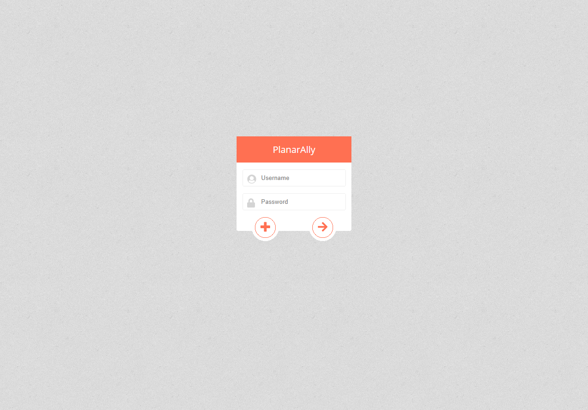
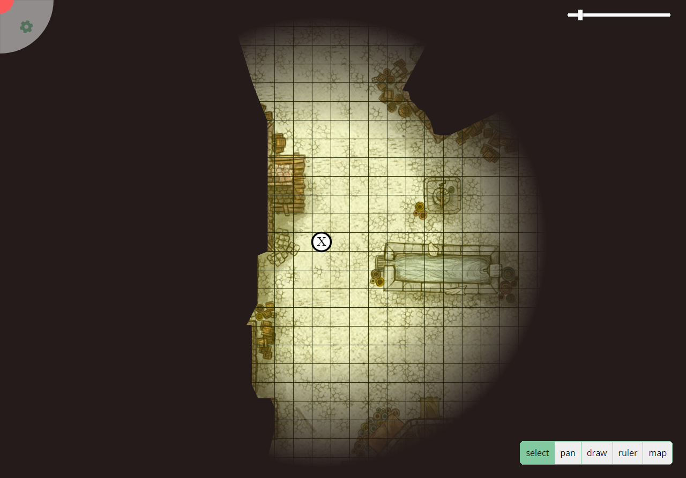
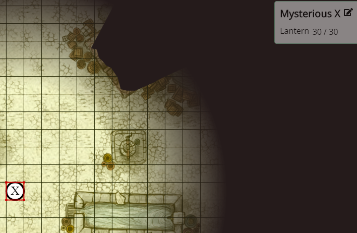
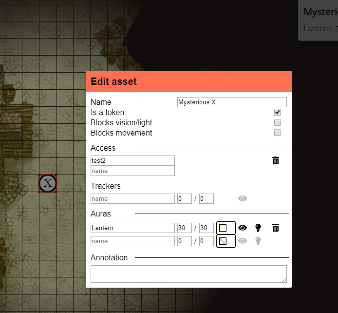
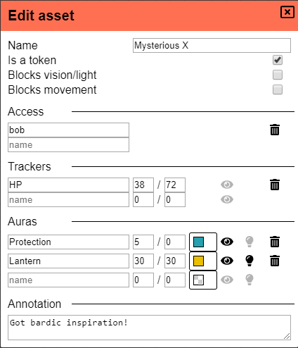
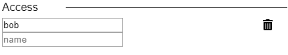
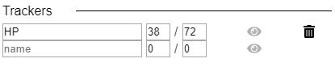
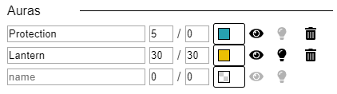
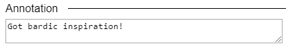

.. _getting_started:

Getting Started (Players)
==========================

This document will show you how to get started using Planar Ally as a player.
To get to know the DM side of PA another document is available over :ref:`here <getting_started_dm>`.

Login
-------

When you are a player you won't need to install anything in order to use Planar Ally.
Your DM will either need to install the software himself or use a public/private provider.

Either way, your DM will have to give you the URL of the hosting he/she chose.
When you visit this URL you should be greeted with a login/registration form like shown below.

If you already have an account, you simply fill in your username and password and press enter
or the right pointing arrow.  If you are a new user, choose your desired username and password
and click on the + button.

.. note::
    If you use Planar Ally for multiple campaigns it's possible that they are played
    on multiple providers and you'll need to create an account on each specific provider.

Session hub
-------------

After logging in you'll be shown a landing page.

.. image:: images/sessions.png

Here an overview of your active sessions is shown.
The first three sessions in the example above are DM'd by the active user.
Whereas the last one is DM'd by a user named frederik.

Creating a new session is straightforward but meant for DM's,
for more information check out the DM guide.

.. note::
    At the time of writing, the account settings page is not yet functional.

Joining a session
~~~~~~~~~~~~~~~~~~

To join a specific session, you need the invite link.
Your DM should provide this to you.

When visiting this link, you'll automatically join the session and in a future visit
to the session hub it should be listed as well.

The game
---------

When we finally are in the right session, the magic can begin!

We'll start of with a short introduction of what happens when you open your first session,
followed by information on the various controls, tools and settings that you can configure.

First impressions
~~~~~~~~~~~~~~~~~~

Upon loading the session, you'll be greeted with whatever your DM has prepared for you.
Let's take a look at an example where the DM has added a base map, added a token and some light/shadows.

Most important UI elements are immediately visible.  We have a button in the topleft that opens a settings menu when pressed,
in the topright there is a slider that controls your zoom level and in the lower right there is a selection of tools that you can use.

We'll give a brief overview of these UI elements soon, there is however another UI element that is currently not visible!

When you select a token that you own, a red border will be drawn around the token to visually give a reminder of what you have selected and on top of that
a box appears at the right side of the screen, with the name of the selected token as well as any tracker or aura active on the token (more on that later).

This is a quick info panel for your token.  A more advanced view is possible by pressing on the edit button in this panel (in the topright).
This panel provides all the options to configure how your token(s) interact with the map.

Controls
~~~~~~~~~

One of the things you'll be doing most is almost certainly going to be moving around.
Getting to know the controls is thus an important element.

Most input is mouse based, but we'll first see some handy keyboard movement options.

Keyboard
^^^^^^^^^

If nothing is selected, using the arrow keys will result in moving the map in the desired direction.
When you've selected a token however, the token itself will move.

.. hint::
    These movements are always 1 grid cell wide, making them ideal for movement during combat.

Pressing `Delete` will delete the current selected token.

Pressing `d` will deselect your current selection.

mouse
^^^^^^

The left and right mouse button behaviour depends completely on the active tool,
the middle mouse button however has the same functionality at all times.

Scrolling will zoom in (or out) to the location where your mouse is currently pointing.

.. note::

    This scrolling behaviour differs from that of the slider,
    which will always focus on the center of the screen.

.. warning::

    Be careful with zooming out too far and then moving around.
    It's easy to lose the battlefield and get lost in the infinity of the void!
    
    Tools to find your path back to reality are in development,
    in the meanwhile you'll have to beg your DM to bring you back.

Pressing (and holding) the middle mouse button additionaly serves as a shortcut for the pan tool.
This is a tool that you'll often use and it would be a hassle to change tools every single time.

.. hint::

    Using the middle mouse button to pan means that you'll be spending less time using the UI and thus
    have more time to play the game!

Additional modifier
^^^^^^^^^^^^^^^^^^^^^

There is an additional modifier that can be used for both mouse and keyboard actions.

ALT
~~~~

When the grid is enabled, most tool actions will by default attempt to "snap" to the grid.
This means that when moving or drawing tokens they will automatically be put in such a way that
they fit the grid.

This behaviour can be ignored by pressing the ALT key while doing the action.

*If the grid is disabled the alt key does not have to be pressed.*

Tools
~~~~~~~

Now then a quick overview of the various tools you can use.
As a player you'll have access to 4 tools.

Select
^^^^^^^^

This tool will be your most used tool as it allows to select tokens allowing you to see more info about them
or moving them.

A selection box can be drawn at any point which will try to select all shapes inside the drawn region,
moving these will behave in a similar way as moving singular tokens.

.. note::

    The selection info box will only show the info of one of the selected items!

Movement can be done by dragging with the left mouse button or by using the arrow keys.

.. note::

    It's possible that your DM has made some objects impossible to pass through,
    so don't panic if you think you're stuck.  If you are actually stuck,
    ask your DM, he/she can free you.

.. warning::

    Unless restricted by terrain, you'll typically be able to move your token freely.
    This does not mean that you should immediately discover everything you can reach,
    let your DM guide you around.  You don't want to spoil yourself! :)

When in select modus, your right mouse button will show a context menu.

When you right click a selection, you'll have the option to move it to the front or back and add or show its initiative.
When nothing is selected, you'll have the option to show the initiative tracker or create a new basic token.

Pan
^^^^

The pan tool simply allows you to pan around when you drag your left mouse button around.

This behaviour is also implemented in the middle mouse button when other tools are selected,
to minimize constant tool changing.

It's heavily encouraged to use the middle mouse pan, but the tool still exists for those cases when you don't have a middle mouse.

Draw
^^^^^

The draw tool allows you to draw some simple shapes!

You can choose between a rectangle, a circle, or a freehand brush.

You also have the option to select two colours.
The left colour is used as the fill colour, the right one as the border colour.
If you wish to only have a fill or only have a border colour, simply set the opacity of the other to 0
*(this is the second slider in the color picker)*.

Ruler
^^^^^^

The last tool currently available is the ruler, it allows for easy measurements.
simply press the left mouse button and drag it.

While holding the button it will show you the distance in ft between your initial click and your current position.

.. note::

    Your ruler is visible to all players!

Your DM can configure the size of one grid cell, which is used to calculate the distance the ruler shows.

Asset configuration
~~~~~~~~~~~~~~~~~~~~~

Let us now look further into the specific configuration of individual assets.
Below you see the asset configuration dialog again from our mysterious X.
In the following paragraphs we'll go over each of these elements to see what they mean
and how you should use them.

Name + State toggles
^^^^^^^^^^^^^^^^^^^^^^

The first things we can configure is the name of the asset as well as
some fundamental settings that decide how the asset acts.

.. image:: images/asset-detail-state.png

The name of an asset has no specific functionality, but is a nice way to differentiate
between multiple assets.

The next three toggles however have an important effect on the behaviour of the asset.

**Is a token**: This is a setting that is very important for the lighting system,
but only if the optional token based vision modus is selected by your DM.

In general it is advised to select this option if the asset represents a player character or
player controlled npc that can move and has vision.

**Blocks vision/light**: When this option is selected, vision and light cannot pass through
the asset.  This is generally used for walls or other static objects, but there is nothing
preventing some wacky scenario where your character has turned to stone or something.

**Blocks movement**: When this options is selected, other assets cannot move through this
asset's space.  This is intended for walls but hey, you never know.

.. note::

    If you cannot see your asset,
    it most likely is due to the 'is a token' setting being disabled.

Ownership
^^^^^^^^^^

Next up is the list of owners.
By default your own name should be included here, if you created the asset.
Every other name listed will also have access to the asset.

When someone has access to an asset, it means he/she will be able to move and/or edit its properties.

.. note::

    The DM automatically has access to all assets.

Trackers
^^^^^^^^^

Trackers are a simple system that allow you to keep track of some numeric information.

A good example is shown in the above image, where the HP of our mysterious X is tracked.

The eye symbol is used to allow people without ownership to see the tracker.

These values are also provided in the smaller selection info box on the right side of the screen
as mentioned earlier, quickly see them without having to open this configuration dialog.

When you left click on the tracker value in this quick info box, a popup allows you to immediately
change the value of these trackers.  You can fill in a new absolute value or a relative value
(e.g. -5 to decrease the tracker by 5).

Auras
^^^^^^

Auras work in a similar way to trackers but also affect the game board.
They are used to visually show ranges of certain effects on the board.

The first input box is the bright radius that the aura has.
The second input box is the dim radius.
The difference is that the dim radius has a gradient dropoff towards half the opacity of the bright circle.

The third box is a simple colour selector and the eye has the same functionality as that for trackers,
whether or not other users that do not own this asset, can see the aura.

The next icon is an important one and decides whether the aura is a normal aura or a light aura.
A normal aura will always fill a circle with the asset at the center.
An example of a normal aura is the aura of protection that the Paladin class provides.

A light emitting aura, is an aura to indicate light sources like lanterns or to show darkvision ranges.
These auras stop at walls and other objects that block vision.

Annotation
^^^^^^^^^^^

The last bit you can configure is the annotation field.
It can be used as a place to write some stuff either permanently or temporary.

When you mouse over this asset, at the top of the screen the content of this field will be displayed.

It can thus be used for reminders or other items affecting the asset that do not fit in the tracker or aura fields.

Settings
~~~~~~~~~